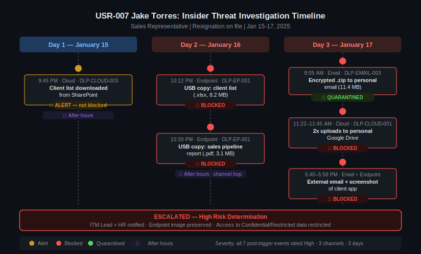

# DLP & Insider Threat Management Lab
### Simulated Financial Services Environment

A hands-on simulation of a bank's Data Loss Prevention (DLP) and Insider Threat Management (ITM) program, built to practice the full analyst workflow: from rule design to alert triage to escalation.

---

## Why I Built This

I was preparing for an entry-level DLP/Insider Threat Analyst role and wanted more than just study notes. I wanted to actually do the job: design a policy, write detection rules, generate realistic event data, and work a real investigation from first alert to escalation recommendation.

I chose a financial services environment specifically because of the regulatory complexity. GLBA, PCI-DSS, and SOX each impose different data handling requirements, and I wanted to practice making the kinds of tradeoffs analysts face daily: when to block vs. alert, how to write exceptions that don't create blind spots, and how to distinguish a false positive Finance email from a genuine exfiltration attempt.

Everything here is fictional. XYZ Bank, its employees, and all event data are fabricated for learning purposes.

---

## What's in This Repo

```
dlp_itm_lab/
├── policies/
│   ├── data_classification.md     # 4-tier classification schema (Public → Restricted)
│   └── dlp_rules.yaml             # Full DLP ruleset across email, endpoint, and cloud
├── detection/
│   └── splunk_queries.md          # 8 SPL queries with analyst notes
├── logs/
│   └── dlp_events.csv             # 41 synthetic events across 13 users
├── playbooks/
│   ├── insider_threat_investigation.md   # Step-by-step investigation procedure
│   └── jake_torres_investigation.md      # Completed case report: USR-007
└── reports/
    └── monthly_report_jan2025.md  # Executive summary, metrics, and tuning recommendations
```

---

## The Scenario

XYZ Bank is a mid-size financial institution subject to GLBA, PCI-DSS, and SOX. The DLP/ITM team monitors data movement across three channels (email, endpoint, and cloud) using a tiered classification policy and a ruleset designed to balance security controls against legitimate business operations.

January 2025 was the baseline month: 41 events, 13 unique users, two escalations.

---

## Featured Investigation: Jake Torres (USR-007)

The most significant case in this dataset involves a Sales Representative who submitted his resignation and then generated 8 high-severity events across 3 days, more than a typical sales employee produces in 1-2 months.



**Day 1 (Jan 15):** Downloaded a client list from SharePoint after hours. Rule fired an alert but did not block.

**Day 2 (Jan 16):** Attempted to copy the same file to a USB drive. Blocked. Then tried a second file (sales pipeline report). Blocked again.

**Day 3 (Jan 17):** Sent an encrypted zip to his personal email. Quarantined. Uploaded client contacts and a financial report to personal Google Drive. Both blocked. Emailed a client file externally. Blocked. Attempted a screenshot of the client management application. Blocked.

**Determination:** High Risk. Pattern consistent with data staging and attempted exfiltration across all three channels. Escalated to ITM Lead and HR.

**Key insight from this case:** DLP-EMAIL-003 quarantined the encrypted zip but did not block it outright. The ruleset was flagged for a tuning recommendation: encrypted archives sent externally should auto-block, not just quarantine, since manual review introduces lag in an active exfiltration scenario.

---

## Policy Design

The ruleset (`dlp_rules.yaml`) covers 10 rules across three channels:

- **Email:** PII in outbound mail, large attachments to external recipients, encrypted archives to external (evasion detection)
- **Endpoint:** USB copy of classified data, bulk file download, printing of restricted data, screen capture of restricted applications
- **Cloud:** Upload to unsanctioned storage, external sharing from sanctioned apps, bulk download (data staging), OAuth token grants to unvetted third-party apps

Each rule includes the trigger logic, classification scope, action, notification chain, known false positive patterns, and exception conditions, mirroring how production rulesets are documented.

---

## Detection: Splunk SPL

Eight queries are documented in `detection/splunk_queries.md`, each written for a specific analyst use case:

1. Morning operational check (event volume by channel and severity)
2. User activity summary (who is generating the most alerts)
3. After-hours data movement
4. Restricted data to external destinations (highest-priority combination)
5. False positive rate by rule (weekly tuning review)
6. Individual user investigation timeline
7. Privileged user monitoring
8. Monthly metrics summary (for governance reporting)

Each query includes a "What I learned" note explaining what the data showed and what follow-up action it informed.

---

## What This Project Covers

- Data classification policy design for a regulated financial institution
- DLP rule logic: trigger conditions, actions, notifications, exceptions, and tuning history
- Behavioral analysis: baselining users, identifying anomalies, recognizing channel-hopping and obfuscation
- Splunk SPL for DLP event triage, investigation, and reporting
- Investigation workflow: context gathering → timeline → technical analysis → risk determination → documentation
- False positive management and rule tuning methodology
- Governance reporting: metrics, control health, exception tracking, and recommendations

---

## Skills Demonstrated

`DLP` `Insider Threat` `Splunk / SPL` `SIEM` `YAML` `Behavioral Analysis` `Incident Response` `Data Classification` `GLBA` `PCI-DSS` `SOX` `Policy Writing` `Security Operations`
